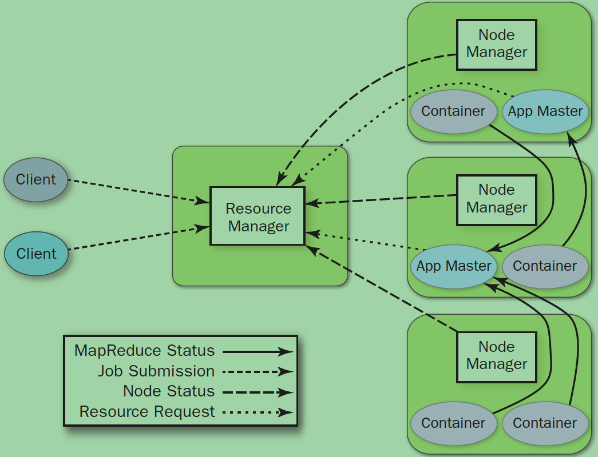

# Hadoop学习指南(YARN篇)
--------

## 前言
从业2年多，也该总结下关于Yarn的东西了。

架构图：

## 核心概念

- ResourceManager: 全局资源管理和任务调度
- NodeManager: 单个节点的资源管理和监控
- ApplicationMaster: 单个作业的资源管理和任务监控
- Container: 资源申请的单位和任务运行的容器

## 参考资料

- [极客学院 Yarn资料](http://wiki.jikexueyuan.com/project/hadoop/yarn.html)