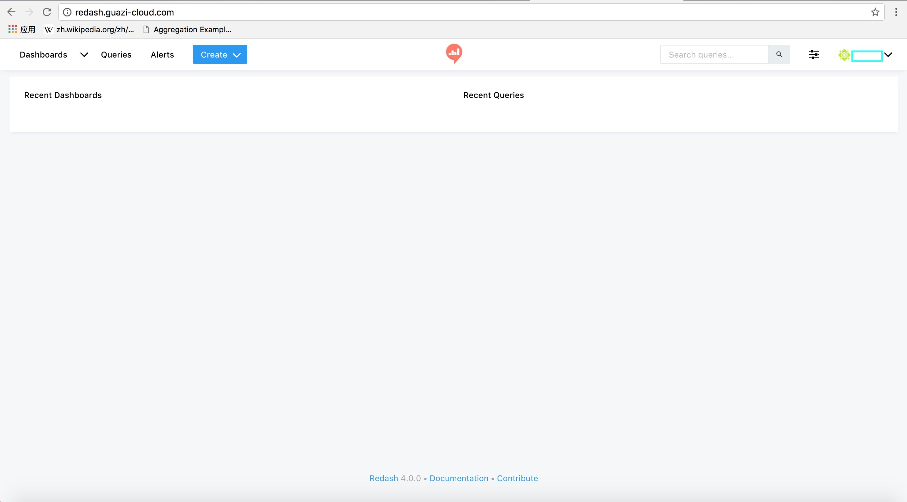
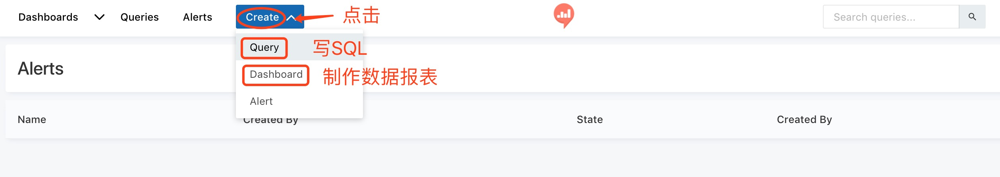
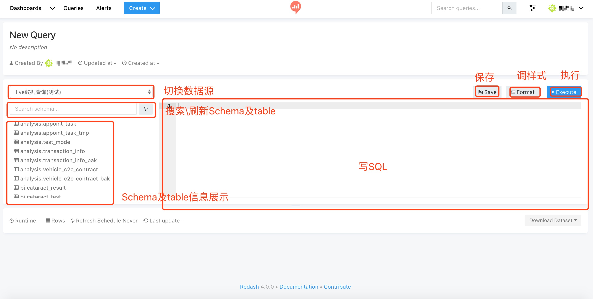
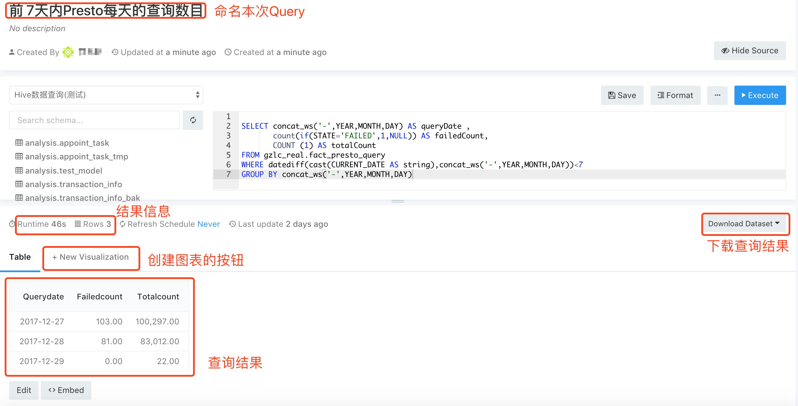
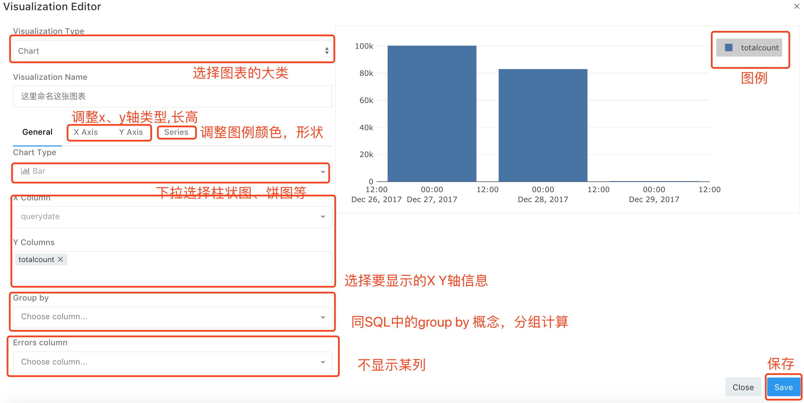
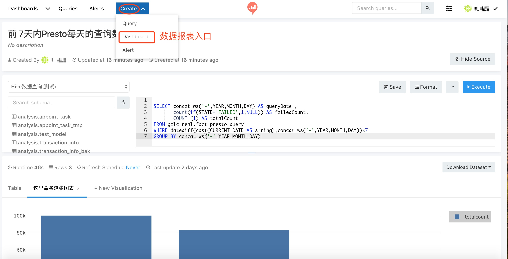
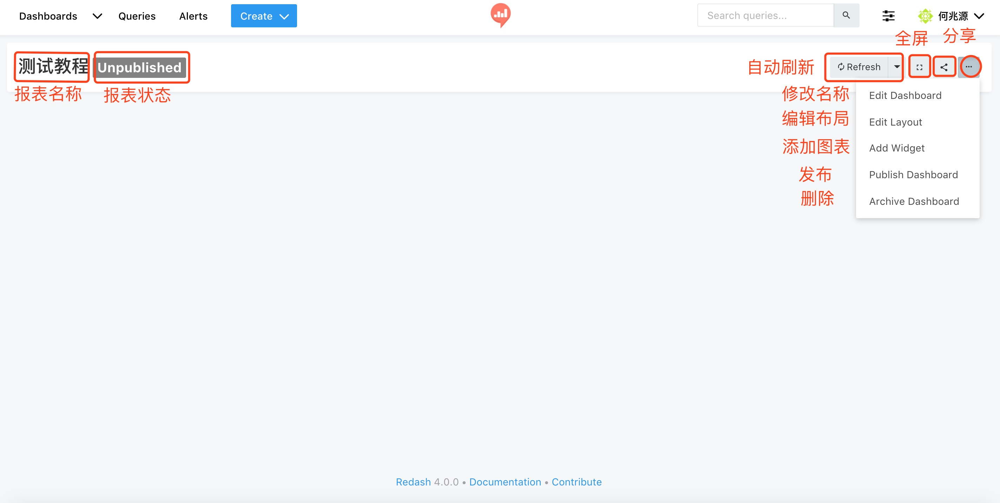
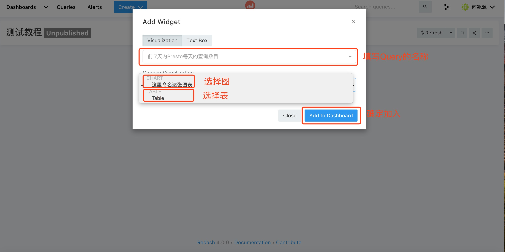
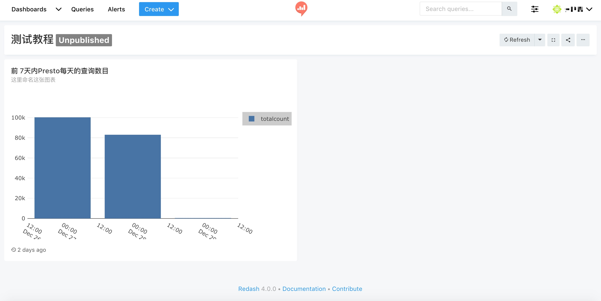

# Redash使用指南
-------

## 一 简介

>Connect to any data source, easily visualize and share your data
>
> ---- from redash.io

 
Redash可以连接多种数据源，将（SQL）查询结果可视化，分享数据报表。总的来说，Redash是一款数据查询与可视化工具。

登陆方式采用LDAP，即公司邮箱**前缀**+密码。登陆后，可以看到清爽的首页：

Redash有两个比较核心的功能：SQL查询，数据可视化。掌握这两个功能，就可以实现自助式查询、分析数据。

Redash更强调SQL的能力，提供有限、可选的数据可视化方法。希望大家使用愉快！

## 二 SQL查询
点击Create按钮，进入相关界面：

点击Query按钮，进入查询界面：

写完SQL，点击Execute按钮即可。

## 三 数据可视化

数据可视化分为两个部分：1. 可视化数据查询结果，2. 制作数据报表面板。

### 可视化数据
写完SQL，成功执行后，获取到查询结果，

点击New Visualzation（创建图表）按钮 ，

保存即可。

### 制作数据报表

点击Create按钮，选择Dashboard选项：

填好Dashboard的名称后，进入制作页面:

点击add widget（添加控件），选择所需的Query及其图表：

结果如下：

## 四 扩展
Redash的可视化的视频操作：http://help.redash.io/article/56-creating-a-new-visualization

Redash官方的使用文档：http://help.redash.io/

