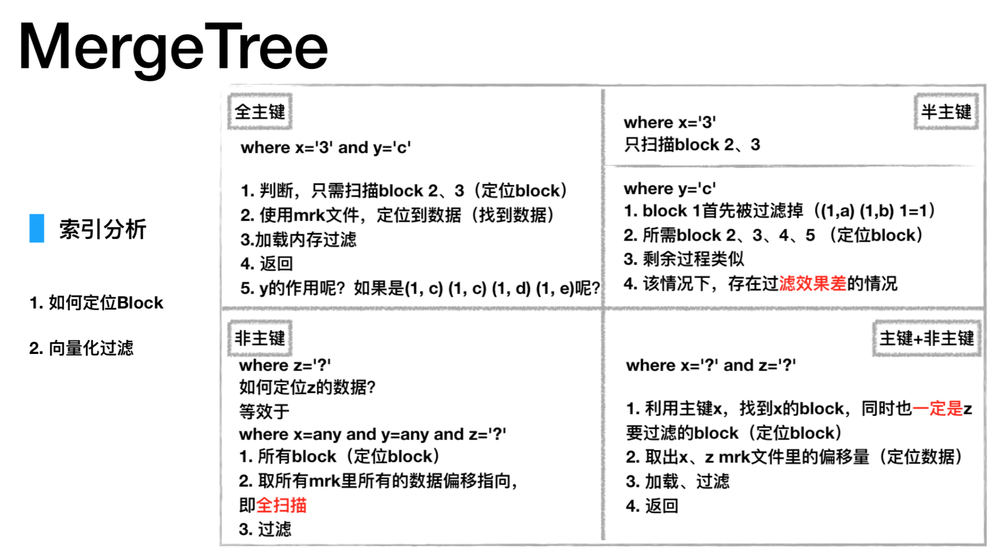

## 前言
1年前，用过Greenplum，这是第一次接触MPP结构的OLAP系统。今天市面上常见的MPP架构工具，还有Clickhouse和Palo等。(当然，SQL on Hadoop体系的Presto和Impala也算是MPP结构，只是数据存储方面没有自己的东西，都是依赖hdfs,mysql等。)

工作需要，对Clickhouse进行学习。

## 安装与启动

Ubuntu上比较好安装，但是一般公司用的服务器都是Centos。这里只讨论在Centos 7的安装方式，centos 6请在Altinity公司提供的下载界面中自行寻找。

### 安装命令

```
如果是装54362版本的包，其余所有依赖都需要是一致的。

准备源依赖，由Altinity公司提供：
curl -s https://packagecloud.io/install/repositories/Altinity/clickhouse/script.rpm.sh | sudo bash

server-common:
sudo yum install clickhouse-server-common-1.1.54362-1.el7.x86_64

server:
sudo yum install clickhouse-server-1.1.54362-1.el7.x86_64

client：
sudo yum install clickhouse-client-1.1.54362-1.el7.x86_64

```

关于Altinity公司的其他版本，可访问[这里下载](https://packagecloud.io/Altinity/clickhouse)。

以上安装如有疑问，可以使用下方安装方式：

- [https://github.com/red-soft-ru/clickhouse-rpm](https://github.com/red-soft-ru/clickhouse-rpm)


### 启动

```
server端：
sudo /etc/rc.d/init.d/clickhouse-server start

client端：
clickhouse-client

```

## 使用经验


### Merge Tree
选择engine时，尽量用merge tree.





## 实际问题

1. 关键字大小写敏感，对强转支持不太好。
2. 特性上不支持事务，不支持update/delete。
3. 关于分布式


## 参考资料


### 官方文档
[What is ClickHouse](https://clickhouse.yandex/docs/en/single/#introduction)


### 配置文件

[ClickHouse相关配置剖析](https://kuaibao.qq.com/s/20180409G06IIM00?refer=spider)

[ClickHouse的分布式引擎](http://note.abeffect.com/note/articles/2017/12/18/1513590469620.html)

### 用户权限

[ClickHouse 用户名密码设置](https://www.jianshu.com/p/e339336e7bb9)

[ClickHouse之访问权限控制](http://www.cnblogs.com/gomysql/p/6708796.html)

### 数据同步
kafka->Clickhouse：[Hangout with ClickHouse](http://jackpgao.github.io/2017/12/27/ClickHouse-with-Hangout/)

mysql->Clickhouse：[使用ClickHouse一键接管MySQL数据分析](http://jackpgao.github.io/2018/02/04/ClickHouse-Use-MySQL-Data/)


### 杂文
奶clickhouse的文章：[ClickHouse Beijing Meetup-数据分析领域的黑马-ClickHouse-新浪-高鹏](https://zhuanlan.zhihu.com/p/33371816)