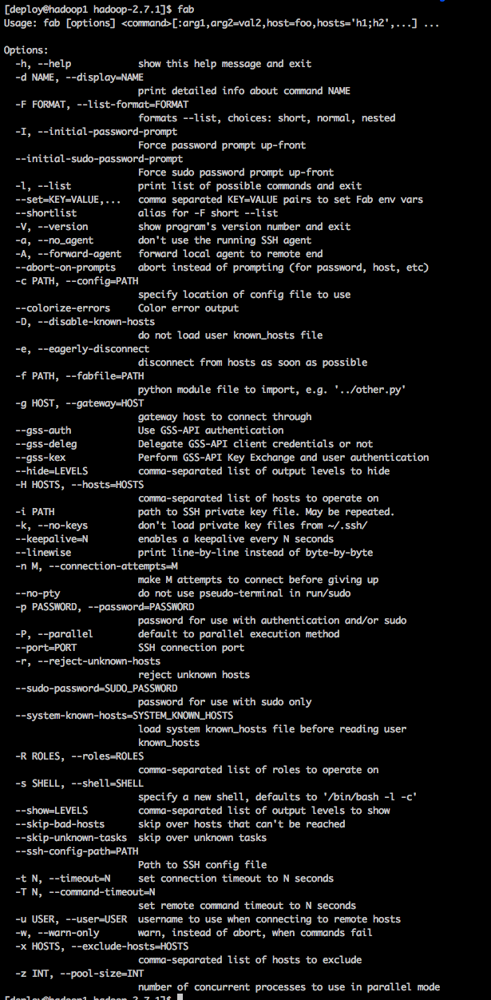

# 大数据开发学习（Fabric）
-------

## 一 前言
本篇介绍Fabric的一些常用知识。要说和网上其他manual的区别，那就是这是笔者写的一套成体系的文档，不是随心所欲而作。

## 二 安装
Fabric现在支持Python2和Python3，安装：

- `pip install fabric`
- `pip install fabric3`

输入`fab`命令：




## 三 使用
在终端（Terminal）执行`fab`命令执行配置文件。默认的配置文件为：fabfile.py，也可以使用`fab -f xxxx.py`来指定配置文件。

除了指定配置文件外，执行需指定具体函数,如：`fab hello` or `fab -f hello.py hello`。

举例说明：
在当前路径下新建2个py文件：fabfile.py和hello.py，输入相同的内容：

```
def hello():
    print("Hello fab!")
```

在当前路径下执行：`fab hello` and `fab -f hello.py hello`,输出结果：


其他使用，参见[《Fabric批量远程执行操作》](http://blog.csdn.net/kongxx/article/details/46480579)

## 六 参考资料

- [Fabric批量远程执行操作](http://blog.csdn.net/kongxx/article/details/46480579)
