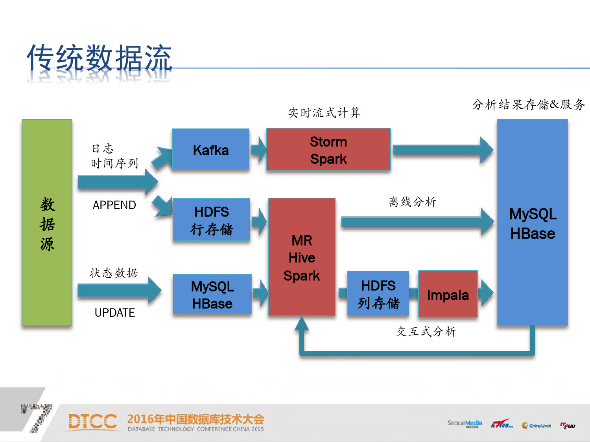

## 前言
kudu，作为OLAP工具十分强劲。本文记录了笔者对其学习和使用的过程。

注明：这篇文章是研究Kudu在OLAP的场景，不准备讨论其他Case。

## 安装与启动
待补充

## 常规使用
教学Demo参见：[Apache Kudu Quickstart](https://kudu.apache.org/docs/quickstart.html)

## 架构体系
kudu架构：

## OLAP服务
作为OLAP服务，ETL环节的处理至关重要。以下列举了小米公司的场景：

对比：

可以看出，除了日志数据外，线上业务数据都可以实时同步到kudu里。基于kudu对外提供OLAP服务，数据的实时性非常可观。

在小米，采用impala作为查询（计算）引擎，但是网上也有presto on kudu的组件可供选型（[传送门](https://github.com/MartinWeindel/presto-kudu)）。

## 使用场景
微店：

 - [Kudu+Impala介绍](https://datascience.weidian-inc.com/kudu_impala/)
- [Kudu的Schema表结构设计](https://datascience.weidian-inc.com/kudu_schema_design/)

## 参考资料

关于Kudu的介绍： [Introducing Apache Kudu](https://kudu.apache.org/docs/#_kudu_impala_integration_features) 

基于Kudu搭建OLAP工具：[小米：使用Kudu搭建OLAP服务](https://myslide.cn/slides/3584?vertical=1)

基于Kudu的实际应用：[使用Spark Streaming + Kudu + Impala构建一个预测引擎](http://www.infoq.com/cn/articles/spark-streaming-kudu-impala)