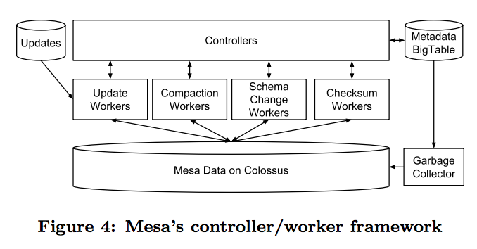

## 前言
Google Mesa是一种高性能、近实时、大规模数据分析仓储体系。

>ABSTRACT
>
Mesa is a highly scalable analytic data warehousing system
that stores critical measurement data related to Google’s
Internet advertising business. Mesa is designed to satisfy
a complex and challenging set of user and systems requirements,
including near real-time data ingestion and queryability,
as well as high availability, reliability, fault tolerance,
and scalability for large data and query volumes. Specifi-
cally, Mesa handles petabytes of data, processes millions of
row updates per second, and serves billions of queries that
fetch trillions of rows per day. Mesa is geo-replicated across
multiple datacenters and provides consistent and repeatable
query answers at low latency, even when an entire datacenter
fails. This paper presents the Mesa system and reports
the performance and scale that it achieves.
>  
> from **'Mesa: Geo-Replicated, Near Real-Time, Scalable Data
Warehousing'**

Mesa设计出了主要是为了广告业务，而且也有解决跨数据中心的问题，在其他场景下可能不适用。

网评，Mesa最大的贡献在其数据模型上，这一点可以找找ORCFile、Parquet进行对比学习。

## 架构体系
在单一数据中心（data center）部署下，主要由两个子系统构成了Mesa。

- Update/Maintenance Subsystem
- Query Subsystem

对于跨数据中心的部署，架构体系和单DC差不都。

### Update/Maintenance Subsystem
主要职责包括:

1. 加载update，并且按照存储模型保存到Mesa的物理存储上。
2. 执行多级的compaction。
3. 在线做schema change。
4. 执行一些表的checksum检查。

### Query Subsystem
工作职责：
>
>Mesa’s query subsystem consists of query servers, illustrated
in Figure 5. These servers receive user queries, look
up table metadata, determine the set of files storing the
required data, perform on-the-fly aggregation of this data,
and convert the data from the Mesa internal format to the
client protocol format before sending the data back to the
client

### 跨DC部署
架构图：

## Mesa的数据模型

此处推荐阅读[《浅谈从Google Mesa到百度PALO》](http://neoremind.com/2017/09/%E6%B5%85%E8%B0%88%E4%BB%8Egoogle-mesa%E5%88%B0%E7%99%BE%E5%BA%A6palo/)关于mesa的存储部分。

暂时没有理解。需要与ORCFile和Parquet进行对比学习。

## 安装与启动
暂时未掌握。

## 参考资料

 - [Mesa: Geo-Replicated, Near Real-Time, Scalable Data
Warehousing](https://static.googleusercontent.com/media/research.google.com/zh-CN//pubs/archive/42851.pdf)