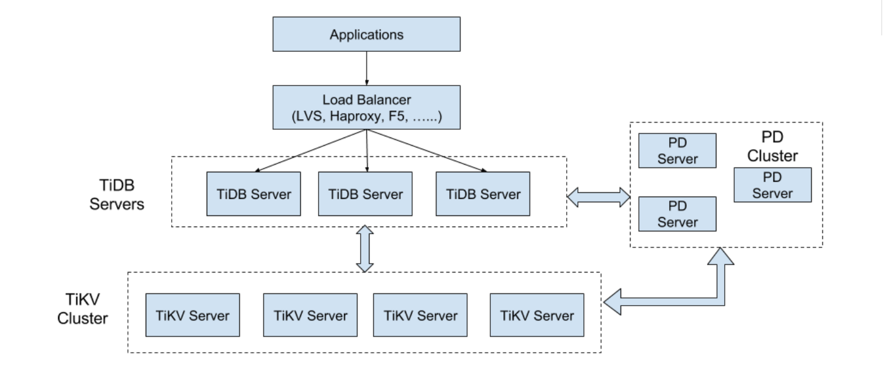
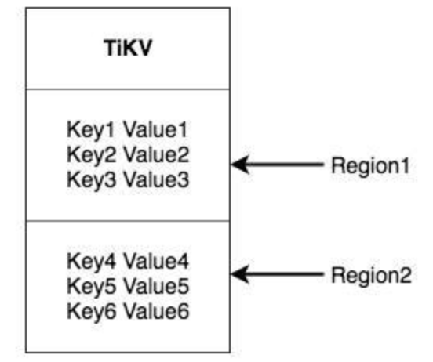
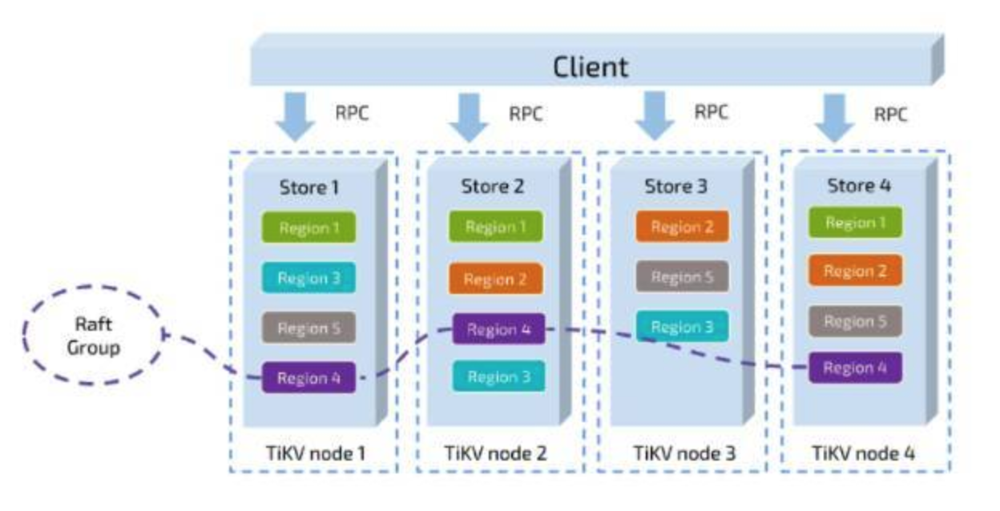

## 前言
TiDB集存储与计算之大成，势头很猛。因为工作需要，进行学习。

>
>TiDB 开源分布式 NewSQL 关系型数据库
>
>TiDB 是新一代开源分布式 NewSQL 数据库，模型受 Google Spanner / F1 论文的启发，实现了自动的水平伸缩，强一致性的分布式事务，基于 Raft 算法的多副本复制等重要 NewSQL 特性。TiDB 结合了 RDBMS 和 NoSQL 的优点，部署简单，在线弹性扩容和异步表结构变更不影响业务， 真正的异地多活及自动故障恢复保障数据安全，同时兼容 MySQL 协议，使迁移使用成本降到极低。

## 系统架构

整体结构：

主要的三个组件的作用：

- TiDB Server

>TiDB Server 负责接收 SQL 请求，处理 SQL 相关的逻辑，并通过 PD 找到存储计算所需数据的 TiKV 地址，与 TiKV 交互获取数据，最终返回结果。 TiDB Server 是无状态的，其本身并不存储数据，只负责计算，可以无限水平扩展，可以通过负载均衡组件（如LVS、HAProxy 或 F5）对外提供统一的接入地址。

- PD Server

>Placement Driver (简称 PD) 是整个集群的管理模块，其主要工作有三个： 一是存储集群的元信息（某个 Key 存储在哪个 TiKV 节点）；二是对 TiKV 集群进行调度和负载均衡（如数据的迁移、Raft group leader 的迁移等）；三是分配全局唯一且递增的事务 ID。

> PD 是一个集群，需要部署奇数个节点，一般线上推荐至少部署 3 个节点。

- TiKV Server

>TiKV Server 负责存储数据，从外部看 TiKV 是一个分布式的提供事务的 Key-Value 存储引擎。存储数据的基本单位是 Region，每个 Region 负责存储一个 Key Range （从 StartKey 到 EndKey 的左闭右开区间）的数据，每个 TiKV 节点会负责多个 Region 。TiKV 使用 Raft 协议做复制，保持数据的一致性和容灾。副本以 Region 为单位进行管理，不同节点上的多个 Region 构成一个 Raft Group，互为副本。数据在多个 TiKV 之间的负载均衡由 PD 调度，这里也是以 Region 为单位进行调度。

### 系统结构2

架构上的理解，推荐三篇官方文档：

- [说存储](https://pingcap.com/blog-cn/tidb-internal-1/)
- [说计算](https://pingcap.com/blog-cn/tidb-internal-2/)
- [谈调度](https://pingcap.com/blog-cn/tidb-internal-3/)

### 分布式机制

### 存储模型

>
>TiKV
 的选择是 Key-Value 模型，并且提供有序遍历方法。简单来讲，可以将 TiKV 看做一个巨大的 Map，其中 Key 和 Value 
都是原始的 Byte 数组，在这个 Map 中，Key 按照 Byte 数组总的原始二进制比特位比较顺序排列。

### Region

>
>将数据划分成 Region 后，我们将会做两件重要的事情：

> - 以 Region 为单位，将数据分散在集群中所有的节点上，并且尽量保证每个节点上服务的 Region 数量差不多
> - 以 Region 为单位做 Raft 的复制和成员管理

总结：

具备MVCC（多版本并发控制  multi-version concurroncy control）功能。

## 安装与启动
暂时未掌握。

## 参考资料

### 参数调优

[TiKV 性能参数调优](https://github.com/pingcap/docs-cn/blob/master/op-guide/tune-tikv.md)

