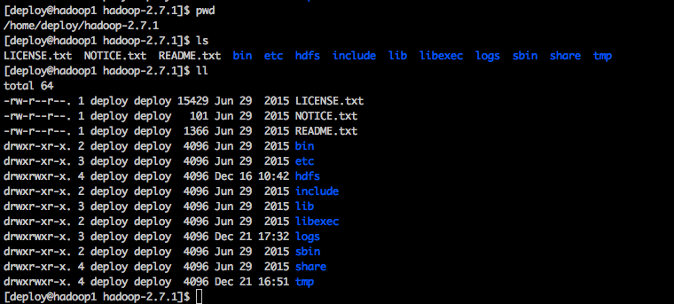
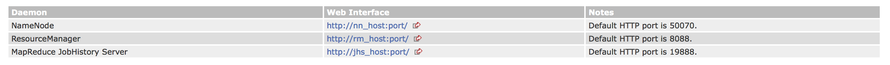
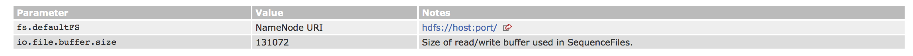
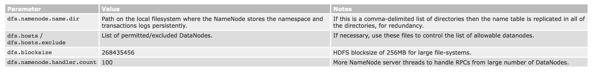
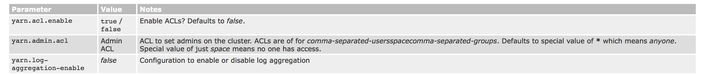
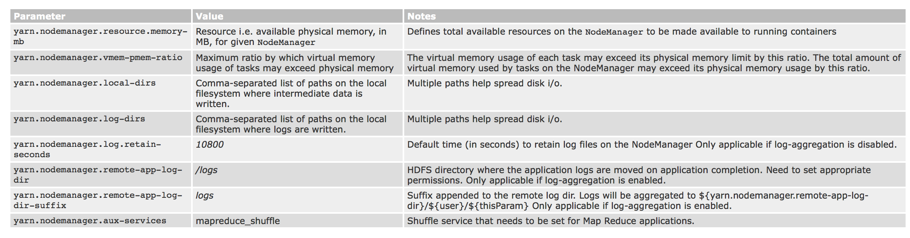
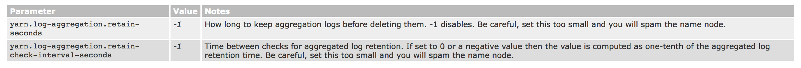
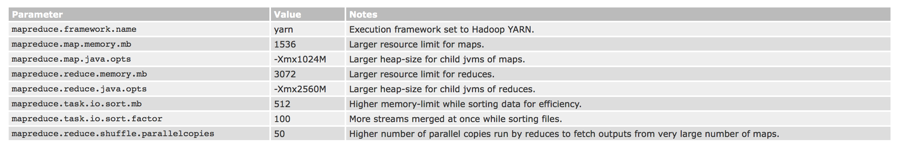
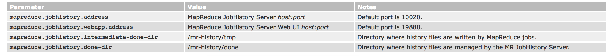

# 集群搭建指南（下卷）
--------

## 前言
**什么是Hadoop?**
>Apache Hadoop is a framework for running applications on large cluster built of commodity hardware. The Hadoop framework transparently provides applications both reliability and data motion. Hadoop implements a computational paradigm named Map/Reduce, where the application is divided into many small fragments of work, each of which may be executed or re-executed on any node in the cluster. In addition, it provides a distributed file system (HDFS) that stores data on the compute nodes, providing very high aggregate bandwidth across the cluster. Both MapReduce and the Hadoop Distributed File System are designed so that node failures are automatically handled by the framework.

本文是用于搭建hadoop集群的学习性文章，主要对hadoop的一些基础知识进行解释，中间穿插着hadoop的安装配置过程。

环境问题：

- 系统：Centos 6.5 64位 minamal版本
- hadoop版本：2.7.1 
- java版本：1.8

可能不具备通用性，仅供参考。

## 安装概览
安装完系统，调通集群内的网络（ssh）,配置好java环境，再进行hadoop的安装。

安装hadoop时，集中精力配置namenode节点这一台机器，修改相关的配置文件，然后使用同步文件（scp）到其他机器上去，hadoop集群搭建即可完成。

值得一提，集群间必须网络通畅，否则无法完成分布式部署。有关问题参见----集群搭建指南（中卷）。

另外，在生成环境中，hadoop的安装均在普通账户下（比如：deploy）完成。所以，新手请注意将java及hadoop安装在开发账户下（是deploy账户的话，位置一般是：/home/deploy/jdk1.8.0_111, /home/deploy/hadoop-2.7.1）。再通过修改账户目录下的 ~/.bash_profile文件修改环境变量。

## 安装步骤
对于5个节点的集群（hadoop1-hadoop5），配置节点hadoop1即可。hadoop集群有很多特性，这里仅设置低配版的hadoop,不添加太多配置属性值，以减轻学习压力。
>This document does not cover advanced topics such as Security or High Availability.

尽管只添加部分属性值，也需要配7个文件：

- core-site.xml
- hdfs-site.xml
- yarn-site.xml
- mapred-site.xml
- hadoop-env.sh
- yarn-env.sh
- slaves

7个文件的解释，参见:hadoop基础知识->1. 配置文件说明。

配置前，假设是:

- 在deploy账户下进行配置
- hadoop文件在：/home/deploy/hadoop-2.7.1/
- java文件在：/home/deploy/jdk1.8.0_111


在/home/deploy/hadoop-2.7.1/目录下，新建文件夹：tmp, hdfs, hdfs/data, hdfs/name

完成后，文件结构是这样：



接下来准备配置，如果在配置过程中发现没有该文件，可以自己新建。如果文件已有内容，可以全部删除/注释，然后添加下述配置。另外，本节给出的多有示例配置的端口都可自己定义，不必追求一致。

### core-site.xml
命令：`vi  /home/deploy/hadoop-2.7.1/etc/hadoop/core-site.xml`

```
<configuration>
    <property>
        <name>fs.defaultFS</name>
        <value>hdfs://hadoop1:9091</value>
        <final>true</final>
    </property>
    <property>
        <name>hadoop.tmp.dir</name>
        <value>file:/home/deploy/hadoop-2.7.1/tmp</value>
        <description>Abasefor oteh temporary directories.</description>
    </property>
</configuration>
```

### hdfs-site.xml
命令：`vi  /home/deploy/hadoop-2.7.1/etc/hadoop/hdfs-site.xml`

```
<configuration>
    <!--配置NameNode-->
    <property>
        <name>dfs.namenode.name.dir</name>
        <value>file:/home/deploy/hadoop-2.7.1/hdfs/name</value>
    </property>

    <!--配置DataNode-->
    <property>
        <name>dfs.datanode.data.dir</name>
        <value>file:/home/deploy/hadoop-2.7.1/hdfs/data</value>
    </property>

    <!--配置Secondary Namenode -->
    <property>
        <name>dfs.namenode.secondary.http-address</name>
        <value>hadoop1:9095</value>
    </property>
    
    <!--修改默认的HDFS配置-->
    <property>
        <name>dfs.replication</name>
        <value>2</value>
    </property>
    <property>
        <name>dfs.webhdfs.enabled</name>
        <value>true</value>
    </property>

</configuration>
```

### yarn-site.xml
命令：`vi /home/deploy/hadoop-2.7.1/etc/hadoop/yarn-site.xml`

```
<configuration>
	<!--下述配置NodeManger-->
    <property>
         <name>yarn.nodemanager.aux-services</name>
         <value>mapreduce_shuffle</value>
    </property>
    <property>
         <name>yarn.nodemanager.resource.memory-mb</name>
         <value>1024</value>
    </property>
    <property>
         <name>yarn.nodemanager.resource.cpu-vcores</name>
         <value>1</value>
    </property>

    <!--下述配置ResourceManager -->    
    <property>
         <name>yarn.resourcemanager.webapp.address</name>
         <value>hadoop1:9099</value>
    </property>
    <property>
         <name>yarn.resourcemanager.hostname</name>
         <value>hadoop1</value>
    </property>
</configuration>
```

### mapred-site.xml
命令：`vi /home/deploy/hadoop-2.7.1/etc/hadoop/mapred-site.xml`

```
<configuration>
    <!--配置MaoReduce应用-->
    <property>
        <name>mapreduce.framework.name</name>
        <value>yarn</value>
    </property>
</configuration>
```

### hadoop-env.sh
命令：`vi /home/deploy/hadoop-2.7.1/etc/hadoop/hadoop-env.sh`

找到export JAVA_HOME的地方，将原来的内容注释，换成：
`export JAVA_HOME=/home/deploy/jdk1.8.0_111`

### yarn-env.sh
命令：`vi /home/deploy/hadoop-2.7.1/etc/hadoop/yarn-env.sh`

找到export JAVA_HOME的地方，将原来的内容注释，换成：
`export JAVA_HOME=/home/deploy/jdk1.8.0_111`

### slaves
命令：`vi /home/deploy/hadoop-2.7.1/etc/hadoop/slaves`

添加你所有datanode节点的hostname,假设有5个节点，名称是hadoop1-5(hadoop1作为namenode),则添加内容：

```
hadoop2
hadoop3
hadoop4
hadoop5
```

## 启动hadoop集群
配置完所有的文件，在该机器（假设是hadoop1）上使用scp命令到其他4台机器上。
命令：

```
scp -r /home/deploy/hadoop-2.7.1/*  deploy@hadoop2:/home/deploy/hadoop-2.7.1/
scp -r /home/deploy/hadoop-2.7.1/*  deploy@hadoop3:/home/deploy/hadoop-2.7.1/
scp -r /home/deploy/hadoop-2.7.1/*  deploy@hadoop4:/home/deploy/hadoop-2.7.1/
scp -r /home/deploy/hadoop-2.7.1/*  deploy@hadoop5:/home/deploy/hadoop-2.7.1/
```

这样集群的配置文件就都一样了。然后,在hadoop1上执行命令，将集群格式化成一个分布式文件系统，执行：`/home/deploy/hadoop-2.7.1/bin/hdfs namenode -format`

**（注：该命令只能执行一次，多次执行的话，需清空前一次执行产生的hdfs/data/、hdfs/name/和tmp/文件夹下生成的文件。但是这样，老集群的数据就会丢失。相关问题已网上的解答为准。）**

接下来启动集群：
`bash /home/deploy/hadoop-2.7.1/sbin/start-all.sh`

查看相关的UI Web界面：


按这里的配置，Namenode程序的可视化界面在hadoop1:50070/(使用的默认端口）,如图：


Secondery Namenode程序的可视化界面在hadoop1:9095/（使用的自定义端口）, 如图：


ResourceManager程序的可视化界面在hadoop1:9099/（使用的自定义端口），如图：


最后，关闭集群：`bash /home/deploy/hadoop-2.7.1/sbin/stop-all.sh`


## hadoop基础知识

### 1. 配置文件说明

简单的配置无安全性的hadoop集群，需要修改：

- core-site.xml
- hdfs-site.xml
- yarn-site.xml
- mapred-site.xml
- hadoop-env.sh
- yarn-env.sh
- slaves

这7个文件均在同一目录：hadoop安装包名/etc/hadoop/。

>To configure the Hadoop cluster you will need to configure the environment in which the Hadoop daemons execute as well as the configuration parameters for the Hadoop daemons.

Hadoop由HDFS、Yarn、MapReduce等组成，hadoop的后台程序，其实就是他们的后台程序。

HDFS后台程序有NameNode,SecondaryNode和DataNode。YARN后台程序有ResourceManager,NodeManager和WebAppProxy。如果MapReduce框架被启用了，MapReduce Job History Server将会运行。（安装完hadoop后，使用jps命令可以看到这些后台程序的名称。）

#### 1.1 配置hadoop后台程序的环境 
管理员可以使用hadoop-env.sh，也可选择性使用mapred-env.sh和yarn-env.sh脚本定制haddoop后台程序的环境。

至少，必须指定JAVA_HOME，以确保正确定义每一个远程节点。

可以配置的选择，在下图：


#### 1.2 配置hadoop后台程序
这部分处理在给定的配置文件中需要被指定的重要参数。

- etc/hadoop/core-site.xml



- etc/hadoop/hdfs-site.xml

配置NameNode:



配置DataNode:


- etc/hadoop/yarn-site.xml

配置ResourceManager和NodeManager：



配置ResourceManager:


配置NodeManager:



配置History Server:



配置NodeManagers的健康监控：


- etc/hadoop/mapred-site.xml

配置MapReduce应用：



配置MapReduce JobHistory Server:


- slaves

>List all slave hostnames or IP addresses in your etc/hadoop/slaves file, one per line. Helper scripts (described below) will use the etc/hadoop/slaves file to run commands on many hosts at once. It is not used for any of the Java-based Hadoop configuration. In order to use this functionality, ssh trusts (via either passphraseless ssh or some other means, such as Kerberos) must be established for the accounts used to run Hadoop.


### 2. Hadoop Map/Reduce框架
#### 2.1 Programming model and execution framework
Map/Reduce是一种编程范式，用于将大型分布式计算表达为对键/值对数据集的分布式操作序列。Hadoop Map/Reduce框架利用一组机器，并在集群中的所有节点上执行用户定义的Map/Reduce作业。一个Map/Reduce计算包含两个阶段：map阶段和reduce阶段。


在map阶段，框架将输入数据集拆分为大量片段，并将每个片段分配给map任务。框架还在其操作的节点集群上分布许多map任务。每个map任务从其分配的片段消耗键/值对，并产生一组**中间**键/值对。 对于每个输入的键/值对（K,V），map任务将调用户自定义的map函数。该函数将输入变换为不同的键/值对(K',V')。

map阶段过后，Map/Reduce框架通过键对中间数据集进行排序，并产一组（K‘,V'*）元组，使得与特定键相关联的所有值一起出现。它还将元组的集合（这组（K',V'）元组）分割成等于reduce任务的数目的多个片段。

在reduce阶段，每个reduce任务消耗分配给他的（K',V'*）元组的片段。对于每个这样的元组，它调用用户自定义的reduce函数，其将元组变换为输出值键/值对(K,V)。框架又一次在节点集群上分配许多reduce任务，并处理将合适的中间数据片段运送到每个reduce任务的事情。


关于hadoop的任务（tasks），有三个特点:

- 每个阶段的任务以容错方式（a fault-tolerant manner）执行，如果节点（多个节点）在计算中间失败，则分配给它（它们）的任务在其余节点之间重新分布
- 任务较多（有许多map和reduce）时，能够实现良好的负载平衡
- 允许失败的任务以最小的运行时间开销重新运行

#### 2.2 Architecture
Hadoop Map/Reduce框架是主(master)/从(slave)架构。它有一个主服务器或jobtracker和几个从服务器或tasktrackers。jobtracker是用户和框架之间的交互点。用户向jobtracker提交map/reduce作业，将作业（job/jobs）放在待处理作业的队列中，并按先到先服务（first-come/first-served）的方式执行。jobtracker管理map和reduce任务到tasktracker的分配。tasktracker根据jobtracker的指令执行任务，并处理map和reduce阶段之间的数据移动。

#### 2.3 Map/Reduce框架小结
网上有很多以上原理的过程图，在hadoop官网上没有找到，但言语上描述的相当清楚。如有需求，自行网上找图。

### 3. Hadoop DFS

#### 3.1 介绍
Hadoop的分布式文件系统旨在：能够在跨大型集群中的机器上可靠地存储非常大的文件。它的灵感来自Google文件系统。Hadoop DFS将每个文件存储为一个块序列，文件中除最后一个块之外的所有块都具有相同的大小。属于文件的块将被复制以实现容错。块大小（block size）和复制因子(replication factor)可以按文件配置。HDFS中的文件是“一次写入”，并且在任何时间都有一个写入程序。

#### 3.2 Architecture
像Hadoop Map/Reduce一样，HDFS遵循主/从架构。HDFS的安装包含一个Namenode,即一个主服务器，用于管理文件系统命名空间并控制客户端对文件的访问。此外，还有一些Datanodes,管理存储附加到他们运行的节点。Namenode进行文件系统命名空间操作，例如：通过RPC接口打开、关闭、重命名等文件和目录。它还确定块（block）到Datanodes的映射。Datanodes负责从文件系统客户端提供读取和写入请求，它们还根据Namenode的指令执行块创建、删除和复制。


## 参考资料

- [Hadoop参数汇总](https://segmentfault.com/a/1190000000709725)
- [Hadoop官网文档--cluster setup instructions in latest 2.x stable release docs](https://wiki.apache.org/hadoop/FrontPage?action=recall&rev=308)
- [hadoop中NameNode、DataNode、Secondary、NameNode、JobTra](https://my.oschina.net/jeeker/blog/620356?p=%7B%7BcurrentPage-1%7D%7D)

